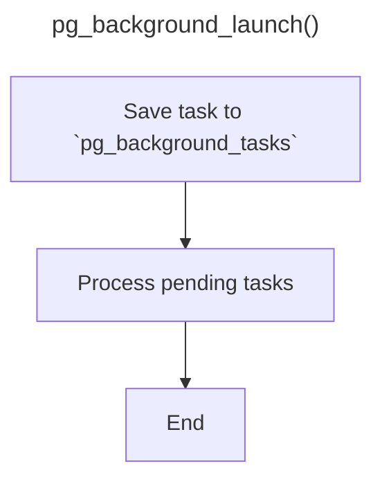
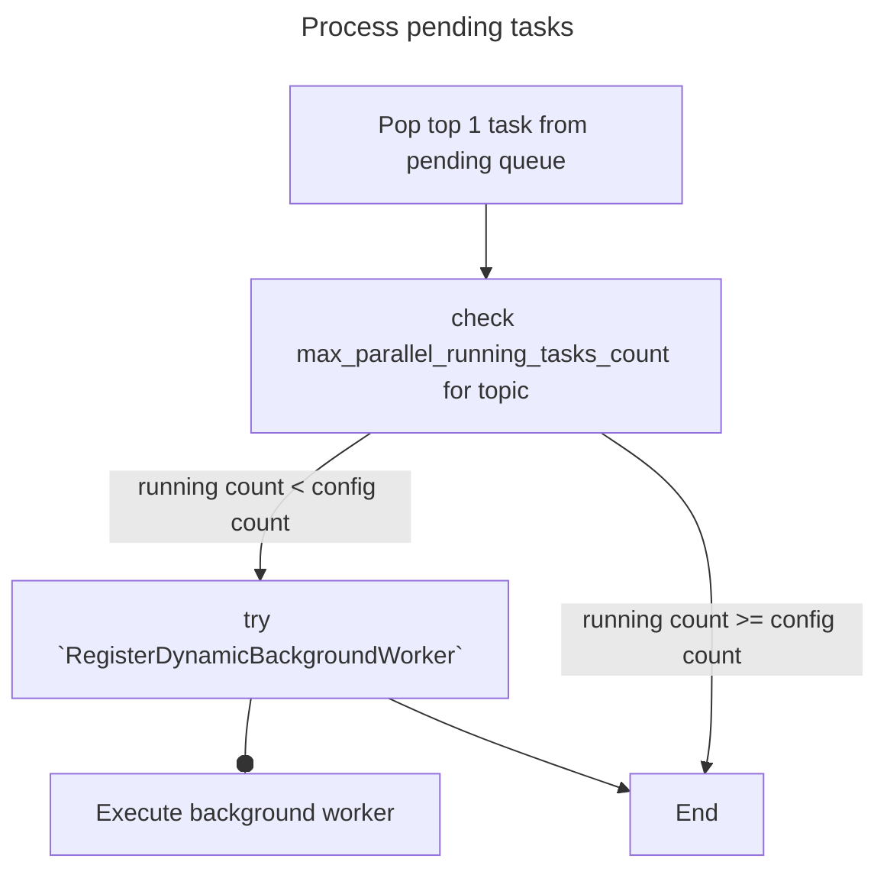
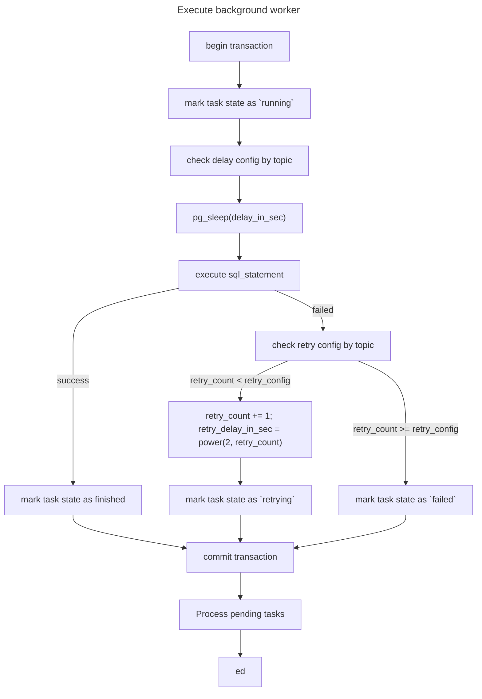

# AGENTS.md

This file provides guidance to Qoder (qoder.com) when working with code in this repository.

## Build and Development Commands

### Building
```bash
# Clean and build
make clean && make

# Install to PostgreSQL
make install
```

### Testing
```bash
# Run regression tests
make installcheck

# Manual testing in psql
psql -d testdb -c "DROP EXTENSION IF EXISTS pg_background CASCADE;"
psql -d testdb -c "CREATE EXTENSION pg_background;"
psql -d testdb -c "SELECT pg_background_launch('SELECT pg_sleep(1)', 65536, 2);"
```

### Installation/Upgrade
```bash
# After code changes
make clean && make install
pg_ctl restart  # or service restart

# In database
ALTER EXTENSION pg_background UPDATE TO '1.5';
```

### Development Environment
* local Postgres
  * bin path: `/Applications/Postgres.app/Contents/Versions/16/bin/postgres`
  * username: `postgres`
  * password: none
  * database: `postgres`

## Current Features Overview
* This is Postgres extension, which allows to create async background task worker

### Problem
* background worker number is limited by `max_worker_processes`.
* when trying to launch tasks over `max_worker_processes` limit, it returns an error.

## New Features - **Concurrency Control**
* Allow user to launch unlimited background tasks.
* When there is not enough background worker available, put the task to a pending queue.
* When background workers are released, pop the task from the pending queue.
* Leave at least `N` background workers for other Postgres processes.
* Limit background task launch rate by specific delay between each tasks in pending queue.
* Allow failed tasks to retry after specific delay and a specific number of retries.
* Allow user to monitor pending / running / finished tasks status.

### Design
1. Define table `pg_background_tasks` for tasks management.
    ```postgresql
    CREATE TYPE STATE_ENUM AS ENUM ('pending', 'running', 'retrying', 'failed', 'finished');
    
    CREATE TABLE pg_background_tasks (
      id BIGSERIAL PRIMARY KEY,
      sql_statement TEXT NOT NULL,
      joined_at TIMESTAMP NOT NULL DEFAULT NOW(),
      started_at TIMESTAMP,
      closed_at TIMESTAMP,
      state STATE_ENUM,
      retry_count INTEGER,
      retry_delay_in_sec INTEGER,
      topics TEXT[],
      errors TEXT
    )
    ```
   
2. Pending queue definition: tasks in `pending` or `retrying` state, order by `joined_at + retry_delay_in_sec` 

3. Once `pg_background_launch` is fired, follow this flow:




4. Configuration:
  - `pg_background.retry_count`: failed task auto retry count, default 0
    - `pg_background.retry_count.topic`: overrides global `retry_count` config for specific topic
  - `pg_background.max_parallel_running_tasks_count`: max parallel running tasks count, default to `max_worker_processes`
    - `pg_background.max_parallel_running_tasks_count.topic`: overrides global `max_parallel_running_tasks_count` config for specific topic
  - `pg_background.delay_in_sec`: delay between each task in pending queue, default 0
    - `pg_background.delay_in_sec.topic`: overrides global `delay_in_sec` config for specific topic

5. SQL function changes:
  - Modify `pg_background_launch()`: add `topics` parameter

### Test
* Test cases are located under `test/` directory

### Extension Versions

- **1.4**: Original version
- **1.5**: New version with new features